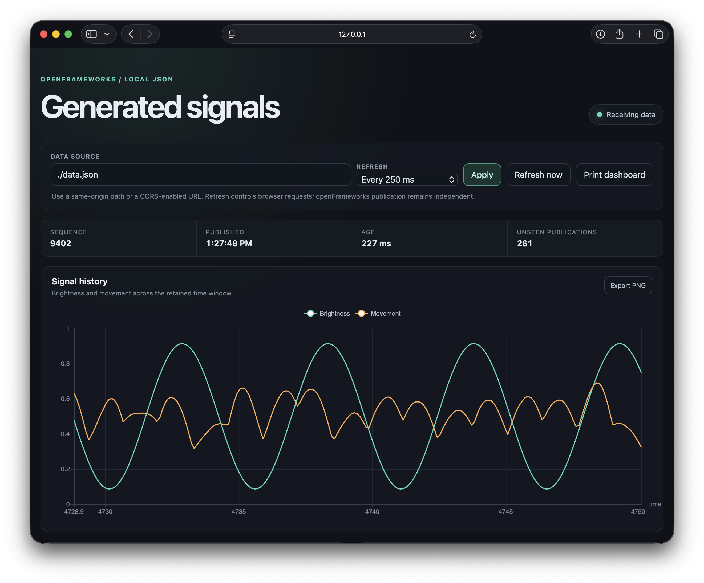

# ofxECharts

First working implementation of a small openFrameworks companion for Apache ECharts. The OF side publishes a complete JSON snapshot. A separate static server exposes the snapshot and supplied browser example.



```text
openFrameworks → data.json → local static server → browser fetch() → ECharts
```

This implementation intentionally contains no HTTP server, socket, cloud synchronization, or browser-to-OF control path.

## Included example

`example-json-line-chart` generates two signals, retains 200 samples, publishes every 500 ms, and displays them in OF and in an automatically updating ECharts dashboard. The dashboard shows a time-series chart, a brightness-versus-movement scatter chart, and a current-values bar chart from the same snapshot and the same browser request.

The publisher validates dimensions and rows, writes a temporary file in the destination directory, and replaces the public snapshot. Temporary Windows sharing failures are retried on later OF updates without sleeping on the main thread. Each successful publication receives a sequence ID and UTC timestamp.

The browser makes one request at a time, bypasses its cache, validates responses, and keeps the last valid chart when publication stops.

## Run the example

1. Clone `ofxECharts` into the openFrameworks `addons` directory:

   ```sh
   cd OF_ROOT/addons
   git clone https://github.com/leeMeredith/ofxECharts.git
   ```
2. Generate or open `example-json-line-chart` and run it.
3. From the example directory, start a local server:

   ```sh
   python3 -m http.server 8000 --bind 127.0.0.1 --directory bin/data/web
   ```

   On Windows, `py -3` can replace `python3`.

4. Open <http://127.0.0.1:8000/>.

Opening `index.html` directly through `file://` will usually prevent the page from fetching `data.json`; use the local address.

## Dashboard controls

The dashboard accepts a same-origin JSON path or a full CORS-enabled URL in **Data source**. **Refresh** controls how often the browser requests that source; it does not change the OF publication interval. The available choices range from 250 ms through 5 seconds and include a paused state. The selected source and interval are reflected in the page URL so a view can be bookmarked.

Each chart has an **Export PNG** action. **Print dashboard** opens the browser's print dialog for printing or saving the complete view as PDF. Exported image filenames include the snapshot sequence ID.

All supplied charts are described by the `chartConfigs` array near the beginning of `app.js`. Add another entry with a title, required dimensions, and an ECharts option builder to render another chart. A chart that derives a different dataset from the snapshot can also provide `buildUpdate`, as demonstrated by the current-values bar chart. The shared poller validates and distributes one snapshot to every configured chart.

## Use it in a Project Generator app

Create the app with Project Generator and select `ofxECharts`. Keep the generated project files, `Makefile`, `config.make`, and `bin` directory. Project Generator adds `ofxECharts` to `addons.make` and references the add-on source from `OF_ROOT/addons/ofxECharts/src`; do not copy the add-on's `src/ofxECharts.*` files into the app.

To reproduce this example in the generated app, copy only:

- `example-json-line-chart/src/*` into the app's `src/`
- `example-json-line-chart/bin/data/web/` into the app's `bin/data/web/`

Do not copy `obj/` or a compiled `.app`. They are local build output and are regenerated by Make or Xcode.

## Minimal C++ use

```cpp
ofxECharts publisher;

void ofApp::setup() {
    publisher.setup("web/data.json", 500);
}

void ofApp::update() {
    ofJson rows = {
        {0.0, 0.42, 0.12},
        {0.1, 0.46, 0.18}
    };
    publisher.setDataset({"time", "brightness", "movement"}, rows);
    publisher.update();
}
```

In an actual sketch, update the dataset when samples change rather than rebuilding it unnecessarily every frame. Call `publisher.update()` every frame so scheduled publication and deferred replacement retries can run.

## Snapshot format

```json
{
  "publishedAt": "2026-09-21T14:00:00.000Z",
  "sequenceId": 42,
  "dataset": {
    "dimensions": ["time", "brightness", "movement"],
    "source": [
      [0.0, 0.42, 0.12],
      [0.1, 0.46, 0.18]
    ]
  }
}
```

Every row must contain one value per unique dimension. Cells may contain strings, booleans, finite numbers, or `null`.

`sequenceId` counts successful publications. A browser may skip IDs because polling and publication run independently; skipped IDs do not necessarily mean samples were lost because each snapshot can contain a history.

## Performance

The supplied 200-row example was measured on an Apple M4 MacBook Air with openFrameworks 0.12.1. It updates the dataset at 10 Hz, publishes at 2 Hz, and runs at 60 FPS with VSync. The table reports 100 publications after 10 warm-up publications.

| Measurement | Release | Debug |
| --- | ---: | ---: |
| Mean complete publication | 0.457 ms | 0.926 ms |
| 95th percentile publication | 0.629 ms | 1.237 ms |
| Mean `setDataset()` validation and copy | 0.022 ms | 0.235 ms |
| Estimated add-on CPU, as a percentage of one core | 0.13% | 0.44% |
| Reported frame rate | 60.003 FPS | 60.002 FPS |

No sustained frame-rate loss was observed. In Release, the 95th percentile publication used 3.8% of one 16.67 ms frame budget, on two frames per second. The browser, ECharts rendering, and static server run outside the OF process and are not included in the OF CPU estimate. Adding charts in the browser does not add another C++ publication or JSON request.

With both publication and browser refresh set to 500 ms, a changed dataset normally appears after about 500 ms on average and within about 1 second in the worst phase alignment. The file operation itself is sub-millisecond on the tested machine. Payload size, storage, machine load, and publication frequency will change these results.

See [the benchmark record](docs/benchmark.md) for the method, distributions, calculations, and scaling guidance.

## Current boundary

The example is a local observation tool. The browser owns chart type, axes, series mappings, labels, and styling in `app.js`. The add-on knows only the dataset contract.

The initial implementation supports one writer and one snapshot file. It does not promise delivery of every publication, synchronized timing, remote hosting, authentication, or large media transfer.

## Dependencies and licenses

The C++ add-on uses only openFrameworks. The example bundles Apache ECharts 6.1.0 for offline use. Its Apache 2.0 license and NOTICE are included beside the browser asset.

The add-on is MIT licensed. See `LICENSE`.

## Verification status

- Repeatedly read while OF replaces the snapshot and confirm that readers receive complete JSON. The initial macOS check completed 91,774 reads with no malformed JSON while sequence IDs advanced from 31 through 36.
- The macOS recovery matrix passed for OF and server restarts, first-snapshot waiting, paused and manual refresh, missing and invalid sources, shorter datasets, and empty datasets.
- The 200-row Release and Debug benchmark is recorded in `docs/benchmark.md`.
- Verify macOS first, then Windows replacement and retry behavior before claiming Windows support.

The example currently compiles and links with openFrameworks 0.12.1 on macOS 26.7 using Apple clang 21.0.0. The local serving check used Python 3.13.7 and returned the HTML page, live 200-row snapshot, and bundled ECharts file successfully. Browser rendering and the recovery matrix completed without console warnings.
